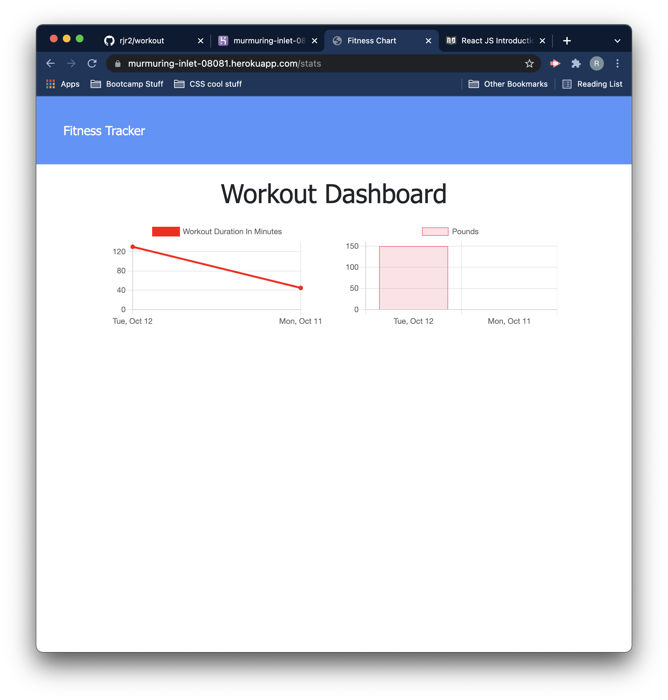

# Workout-Tracker

## Description

An application that allows users to track daily workouts. It allows a user to create a new workout and update and update an existing one.

This application uses Node and Express.js. MongoDB handles the database and aggregrate functions.

## Deployment

Workout tracker has been deployed on [Heroku](https://murmuring-inlet-08081.herokuapp.com/).

The GitHub repo can be found [here](https://github.com/rjr2/workout)

## ScreenShots

## Contributors

This is a completed repo and I am the sole contributor.

## Credits

UofR Full Stack bootcamp for providing front end code.

## license

MIT